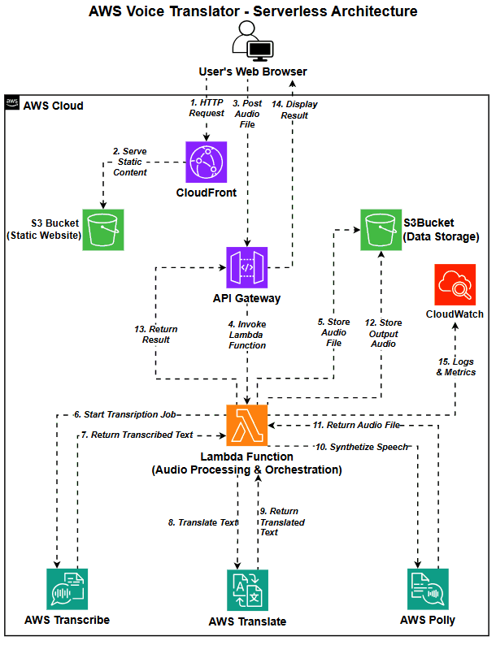
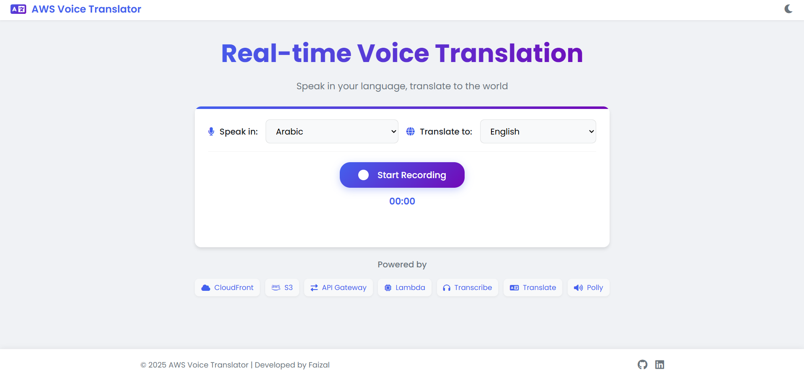
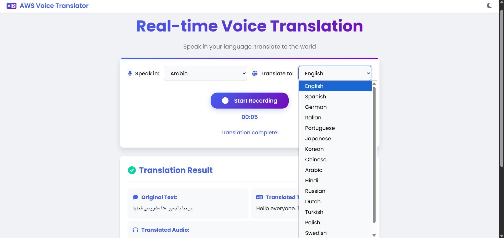
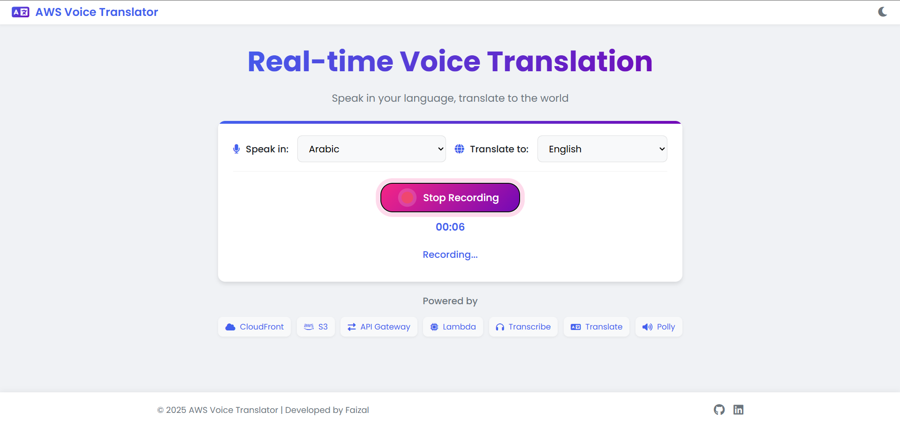
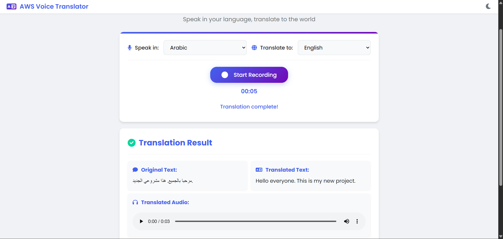
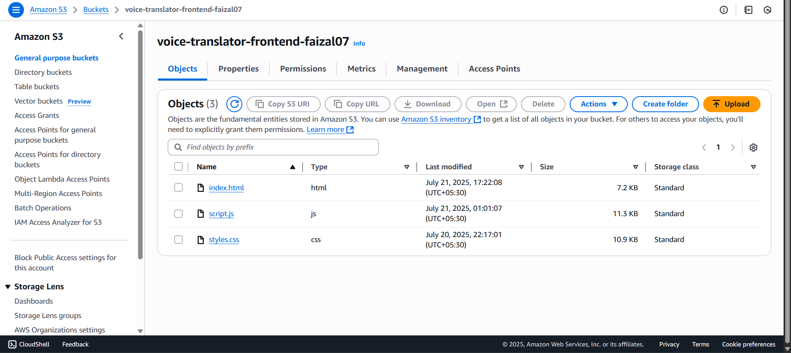
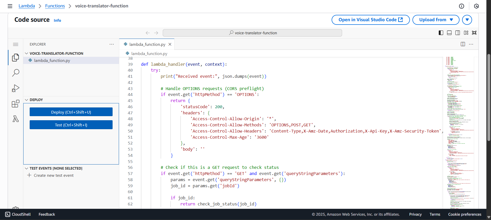
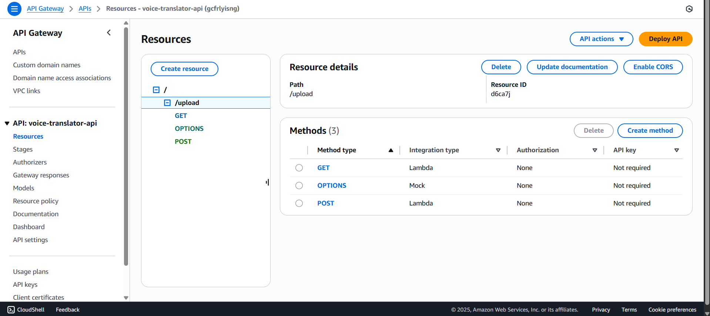
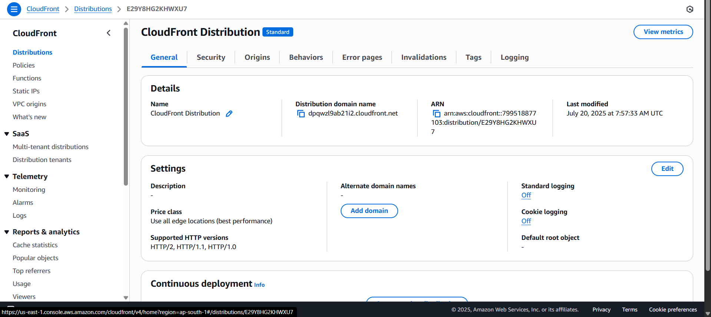

# 🌎 AWS Voice Translator

A real-time voice translation web application built with AWS AI services. Speak in your language, translate to the world!

## 🚀 Features

- **🎤 Voice Recording**: Record voice directly from the browser
- **🌍 Multiple Languages**: Support for 16 languages including English, Spanish, German, Hindi, and more
- **🔊 Real-time Processing**: Instant transcription, translation, and speech synthesis
- **📱 Responsive Design**: Works perfectly on desktop and mobile devices
- **☁️ Serverless Architecture**: Fully serverless implementation on AWS

## 🏗️ Architecture

This application uses a serverless architecture with the following AWS services:

- **📦 Amazon S3**: Hosts the static website and stores audio files
- **🌐 Amazon CloudFront**: Delivers the frontend with low latency
- **🔌 Amazon API Gateway**: Provides REST API endpoints
- **⚡ AWS Lambda**: Processes audio and orchestrates the translation workflow
- **🎯 Amazon Transcribe**: Converts speech to text
- **🔄 Amazon Translate**: Translates text between languages
- **🔊 Amazon Polly**: Converts translated text back to speech
- **📊 Amazon CloudWatch**: Monitors and logs application activity

## 🔍 How It Works

1. User selects source and target languages
2. User records audio through the browser
3. Audio is sent to API Gateway and processed by Lambda
4. Lambda uses Transcribe to convert speech to text
5. Lambda uses Translate to translate the text
6. Lambda uses Polly to convert the translated text to speech
7. Results are displayed to the user

## 💻 Technologies Used

- **Frontend**: HTML, CSS, JavaScript
- **Backend**: Python (AWS Lambda)
- **AWS Services**: S3, CloudFront, API Gateway, Lambda, Transcribe, Translate, Polly, CloudWatch

## 📸 Screenshots

### 📱 Application UI

#### 🏠 Main Interface

*Main application interface with language selectors and record button*

#### 🌐 Language Selection

*Dropdown showing all 16 supported languages for translation*

#### 🎙️ Voice Recording

*Active recording session with timer and stop button*

#### 🔄 Translation Results

*Completed translation showing original text, translated text, and audio player*

### ☁️ AWS Configuration

#### 📦 S3 Website Hosting

*S3 bucket configuration for static website hosting*

#### ⚡ Lambda Function

*Lambda function code handling audio processing and AI service orchestration*

#### 🔌 API Gateway

*API Gateway endpoints for handling audio uploads and status checks*

#### 🌐 CloudFront Distribution

*CloudFront CDN configuration for global content delivery*

## 🛠️ Setup and Deployment

### Prerequisites
- AWS Account
- Basic understanding of AWS services
- Web browser with microphone access

### Deployment Steps
1. Create an S3 bucket for hosting the website
2. Upload frontend files to the S3 bucket
3. Configure S3 for static website hosting
4. Create a CloudFront distribution
5. Create an API Gateway REST API
6. Create a Lambda function with the provided code
7. Configure necessary IAM permissions
8. Deploy and test the application

## 💰 Cost

This application runs entirely within AWS free tier limits:
- Lambda: 1M requests/month
- S3: 5GB storage
- API Gateway: 1M requests/month
- AWS AI services: Limited free tier usage

## 🔗 Live Demo

[Try AWS Voice Translator](https://dpqwzl9ab21i2.cloudfront.net/)

## 👨‍💻 Author

**Yash kale**
- GitHub: [@yashkale402](https://github.com/yashkale402)
- LinkedIn: [Yash Kale](https://www.linkedin.com/in/yashkale001/)

## 📄 License

This project is licensed under the MIT License.